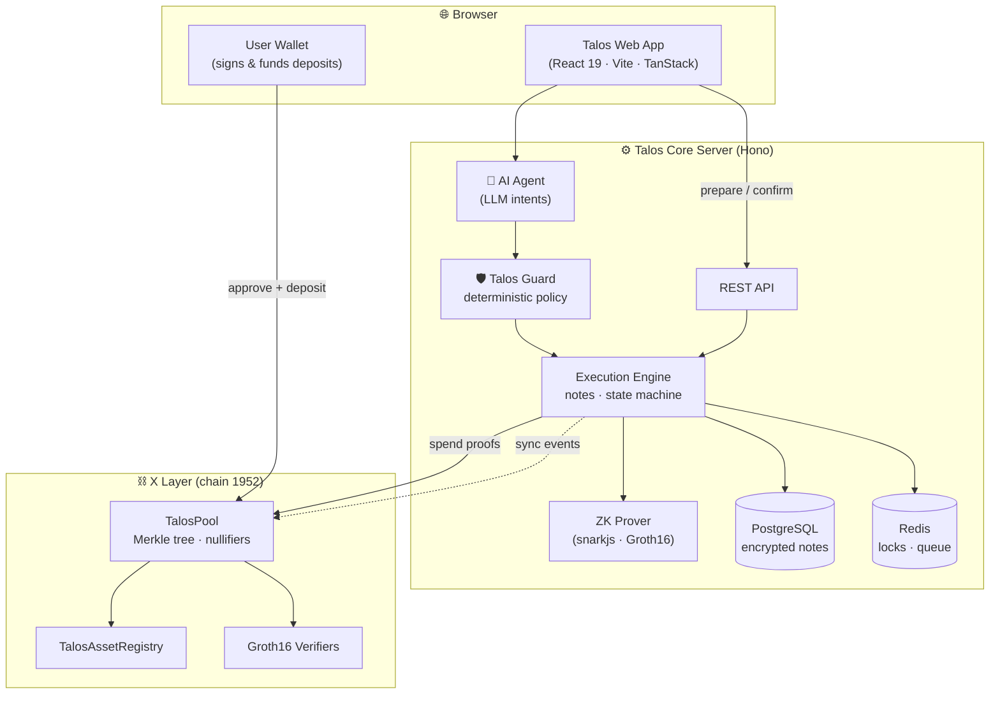
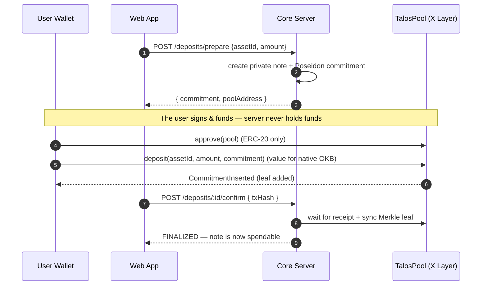
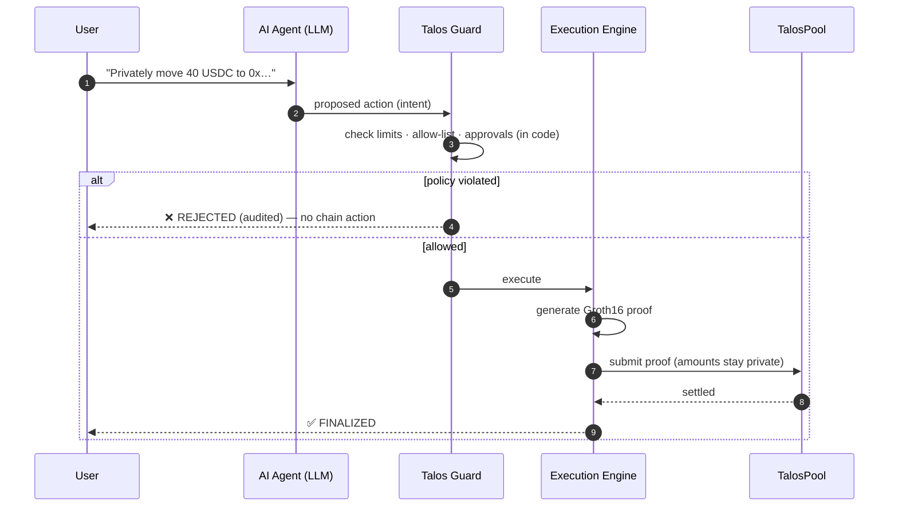

<div align="center">


# Talos

### The Private Execution Layer for AI Agents on X Layer

Shield your assets into zero-knowledge private notes, then let an AI agent move that
capital **privately** — while a deterministic policy engine, not the language model,
holds the authority to act.

[-A3F61E?style=for-the-badge)](https://www.okx.com/xlayer)
[](circuits/)
[](contracts/)
[](apps/web/)
[](#license)

</div>

---

## The Problem

On a public chain, every balance and every transfer is visible. An autonomous AI agent
that manages capital on-chain therefore **leaks its entire strategy** — positions, sizing,
counterparties, timing — to anyone watching. And handing an LLM a hot wallet is reckless:
a single prompt injection can drain it.

## What Talos Does

Talos is a **private execution layer**. Users shield ERC-20s and native OKB into
zero-knowledge **private notes** (Poseidon commitments in an on-chain Merkle tree). Value
can then be split, merged, transferred, and withdrawn using **Groth16 proofs** — the chain
verifies correctness while amounts, owners, and links between notes stay hidden.

An AI agent operates on top of this, but **it never holds keys or bypasses policy**. Every
action the agent proposes passes through **Talos Guard** — a deterministic, code-enforced
authorization layer (spending limits, allow-lists, approvals) that the language model
cannot talk its way around.

> **Non-custodial by design:** deposits are signed and funded by the user's own browser
> wallet. The server orchestrates notes and proofs; it never takes custody of user funds.

---

## Highlights

- 🕵️ **Private balances & transfers** — Poseidon commitments, nullifiers, and a 20-deep
  Merkle tree. The public chain sees proofs, not amounts.
- 🔐 **Deterministic AI guardrails** — policy is enforced in code, outside the LLM. No
  natural-language instruction can widen a limit or an allow-list.
- ✍️ **User-signed, non-custodial deposits** — the connected wallet approves and funds
  every shield; the protocol never custodies funds.
- 🪙 **Multi-asset** — USDC, USDT, USDG, and **native OKB**, each uniquely bound on-chain so
  one token can never be spent as another.
- 👛 **Per-wallet isolation** — each connected address sees only its own private notes.
- ⚡ **Live on X Layer testnet** — real contracts, real proofs, real transactions.

---

## Live Deployment — X Layer Testnet (chain `1952`)

| Contract | Address |
| --- | --- |
| **TalosPool** | [`0x1eb0B5a2fc64E6265F9aE44Ad57b3De5bB11c594`](https://www.oklink.com/xlayer-test/address/0x1eb0b5a2fc64e6265f9ae44ad57b3de5bb11c594) |
| **TalosAssetRegistry** | [`0xb5cfbe9bDF18e4971bf963fDb610AD1a6b80C290`](https://www.oklink.com/xlayer-test/address/0xb5cfbe9bdf18e4971bf963fdb610ad1a6b80c290) |
| Poseidon Hasher | `0x2a3Bad9E0fD2E2c3fC8B56B6CbB85e78309575ED` |
| Transfer Verifier | `0xcea78659d285a427c5563652b0a80c64f32a2a38` |
| Split Verifier | `0xd510489a39ea3c13c02033c067a4de79e3dba462` |
| Merge Verifier | `0x046c76a62c23799b9b77bb50703553587def5e0c` |
| Withdraw Verifier | `0xd607bc628df0aaab4c579fe5c65608ff071b998a` |

### Registered assets

| assetId | Symbol | Token |
| --- | --- | --- |
| 1 | USDC | `0xcb8bf24c6ce16ad21d707c9505421a17f2bec79d` |
| 2 | USDT | `0x9e29b3aada05bf2d2c827af80bd28dc0b9b4fb0c` |
| 3 | USDG | `0xa78e2baabaf5c4f36b7fc394725deb68d332eec1` |
| 4 | OKB | native (gas token) |

---

## Architecture



### Shield (deposit) — non-custodial, user-signed



### AI Agent → Guard → Private action



---

## Tech Stack

| Layer | Technology |
| --- | --- |
| **ZK circuits** | Circom · Groth16 · Poseidon (BN254) |
| **Contracts** | Solidity 0.8.30 · Foundry |
| **Core server** | TypeScript · Hono · Drizzle/PostgreSQL · BullMQ/Redis · viem |
| **Prover** | snarkjs |
| **Frontend** | React 19 · Vite · TanStack Router/Query · Tailwind v4 · framer-motion |
| **Chain** | X Layer (OKX L2) |

---

## Repository Structure

```
talos/
├── apps/web/          # React frontend (dashboard, shield, agent, activity)
├── services/core/     # Core server: API, agent, guard, engine, prover, DB
├── contracts/         # Solidity: pool, asset registry, verifiers (Foundry)
├── circuits/          # Circom circuits + build artifacts (wasm/zkey/vkey)
└── docker-compose.yml # Local PostgreSQL + Redis
```

---

## Getting Started

**Prerequisites:** Node ≥ 20, pnpm, Docker, and [Foundry](https://book.getfoundry.sh).

```bash
# 1. Install
pnpm install

# 2. Start datastores (Postgres + Redis)
docker compose up -d

# 3. Configure — copy and fill in the env files
cp .env.example .env                 # server + contracts
cp apps/web/.env.example apps/web/.env   # web app (VITE_ vars)

# 4. (Optional) Deploy fresh contracts to X Layer testnet
bash testnetdeploy.sh                # reads .env, runs the Foundry deploy

# 5. Run the Core Server (auto-migrates, connects to the chain)
pnpm --filter @talos/core dev        # http://localhost:3000

# 6. Run the web app
pnpm --filter @talos/web dev         # http://localhost:3000 → app at /app
```

Then open the app, connect a wallet funded with X Layer testnet assets, and **shield** a
token into a private note.

---

## Security Model

- **The LLM has no authority.** Talos Guard enforces every limit and allow-list in
  deterministic code; a prompt cannot widen permissions. Every decision is audited.
- **Proofs are the authority.** The chain verifies a Groth16 proof for every private
  spend — the server cannot move value without one, and each proof's public signals are
  checked against the intended action before submission.
- **Non-custodial deposits.** Users sign and fund their own shields from their wallet.
- **Unique asset binding.** Each token maps to exactly one `assetId` in the on-chain
  registry, so a note can never be spent as a different asset.
- **Secrets encrypted at rest.** Note secrets are AES-256-GCM encrypted in the database;
  they are never returned by any API.
- **Nullifiers prevent double-spends**, checked on-chain before every spend.

---

## License

MIT
