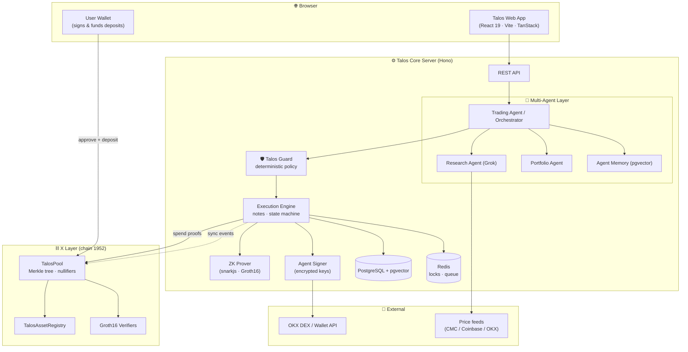
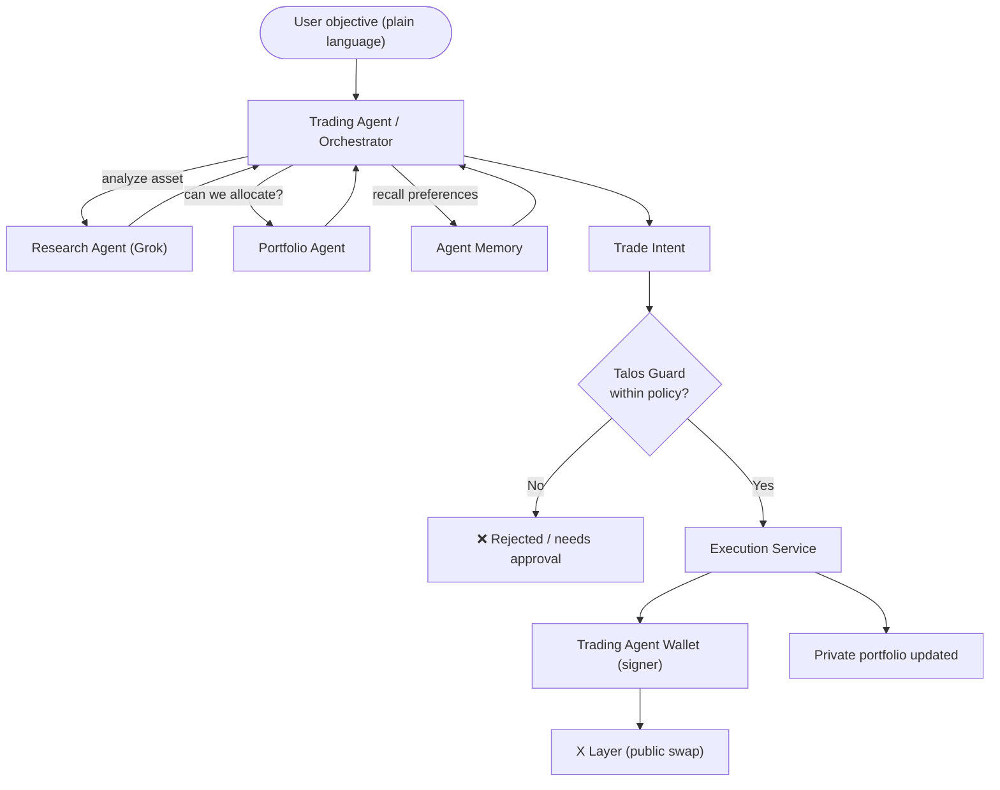
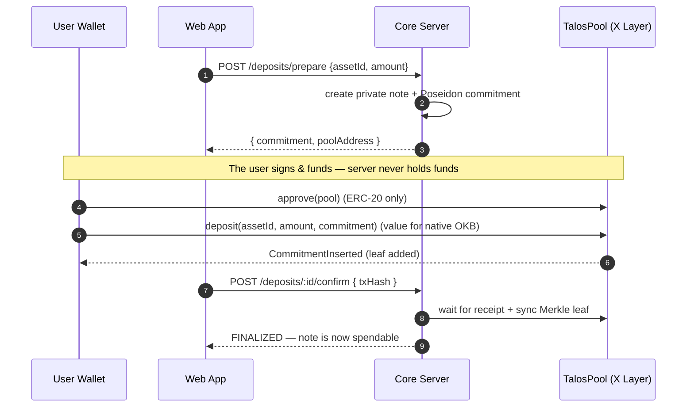
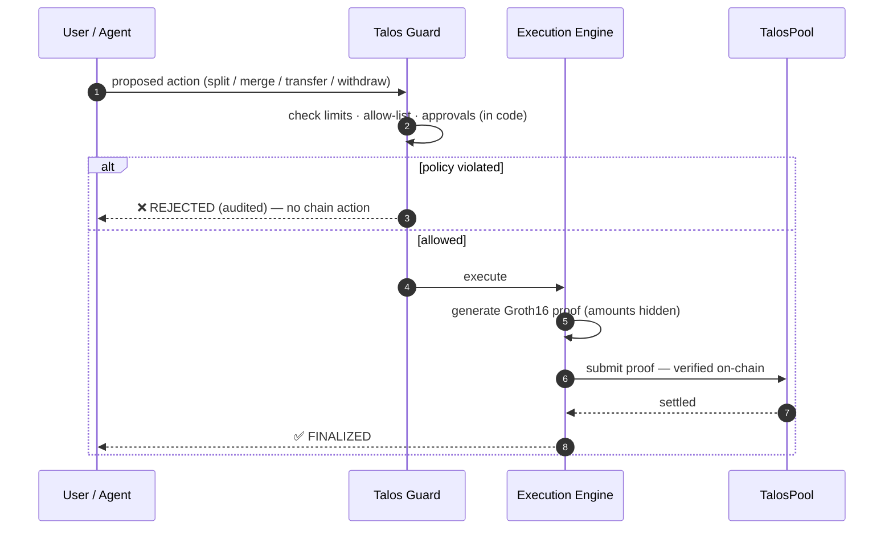
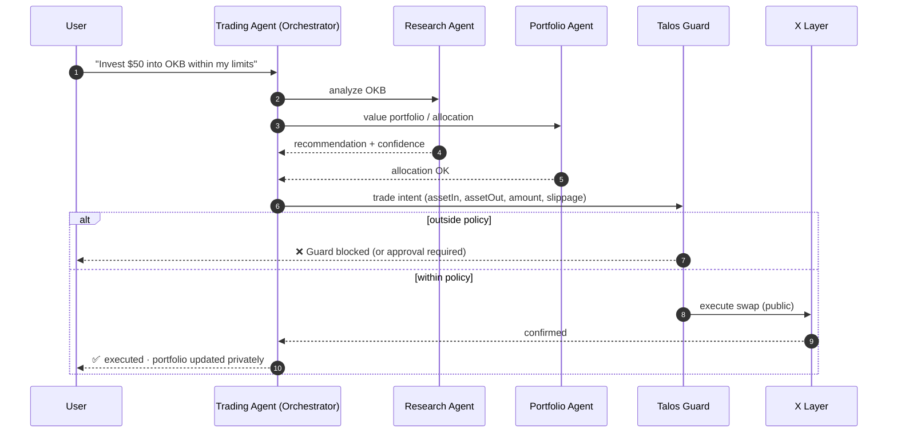

<div align="center">


# Talos

### The Private AI Trading & Execution Layer on X Layer

Shield assets into zero-knowledge private notes, then let a team of AI agents research,
decide, and trade on your behalf — while a deterministic policy engine (not the language
model) holds the authority to act, and profits can be moved to your wallet **privately**.

[-A3F61E?style=for-the-badge)](https://www.okx.com/xlayer)
[](circuits/)
[](contracts/)
[](services/core/src/agents/)
[](apps/web/)
[](#license)

</div>

---

## Table of Contents

1. [Overview](#overview)
2. [The Problem](#the-problem)
3. [What Talos Does](#what-talos-does)
4. [Key Features](#key-features)
5. [System Architecture](#system-architecture)
6. [The Multi-Agent System](#the-multi-agent-system)
7. [Agent Memory](#agent-memory)
8. [Core Flows](#core-flows)
9. [Security Model](#security-model)
10. [Live Deployment](#live-deployment--x-layer-testnet-chain-1952)
11. [Tech Stack](#tech-stack)
12. [Repository Structure](#repository-structure)
13. [API Reference](#api-reference)
14. [Getting Started](#getting-started)
15. [Environment Variables](#environment-variables)
16. [Testing](#testing)
17. [License](#license)

---

## Overview

**Talos** is an AI-native private trading and asset-management system built on
[X Layer](https://www.okx.com/xlayer). It combines three things that normally don't
coexist:

- **Zero-knowledge privacy** — assets live as Poseidon commitments in an on-chain Merkle
  tree; balances, owners, and the links between notes stay hidden. Spends are authorized by
  **Groth16 proofs**, not by revealing amounts.
- **A multi-agent AI layer** — a **Research** agent, a **Portfolio** agent, and an
  autonomous **Trading** agent (the orchestrator) collaborate to turn a plain-language
  objective into an executed, policy-checked trade.
- **A deterministic security boundary** — **Talos Guard** enforces every limit in code,
  outside the LLM. The AI can reason and act, but it can never bypass policy, and it never
  touches a private key.

The result feels like an **AI trading terminal + private wallet + institutional portfolio
dashboard**, all on one chain.

---

## The Problem

On a public chain, every balance and every transfer is visible. An autonomous AI agent
that manages capital on-chain therefore **leaks its entire strategy** — positions, sizing,
counterparties, and timing — to anyone watching. And handing a language model a hot wallet
is reckless: a single prompt injection can drain it.

Talos separates the three concerns that must never be conflated:

| Concern | Owner in Talos |
| --- | --- |
| **Reasoning** (what to do) | AI agents (Research / Portfolio / Trading) |
| **Authority** (what's allowed) | Talos Guard — deterministic, code-enforced |
| **Custody** (who signs) | The user's wallet, or an encrypted agent signer — never the LLM |

---

## What Talos Does

Users shield ERC-20s and native OKB into zero-knowledge **private notes**. Value can then be
**split, merged, transferred, and withdrawn** using Groth16 proofs — the chain verifies
correctness while the amounts and ownership stay private.

On top of this sits an **autonomous Trading Agent** that owns a dedicated execution wallet
and coordinates the read-only Research and Portfolio agents. You give it one objective in
plain language; it researches, sizes the trade, submits it to Talos Guard, and — if within
policy — **executes publicly on X Layer**, then can move the proceeds to your wallet
**privately**.

> **Privacy scope (by design):** *portfolio state, ownership, strategy, and internal agent
> state are private.* A DEX swap itself settles publicly on X Layer — Talos does not claim
> otherwise. Privacy applies to your notes and to transfers (e.g. moving profits to your
> wallet), not to the public settlement of a swap.

> **Non-custodial by design:** user deposits are signed and funded by the user's own
> browser wallet. The Trading Agent's wallet key is AES-encrypted at rest and used only
> behind a signer boundary — never exposed to the model, an API, or a log.

---

## Key Features

- 🕵️ **Private balances & transfers** — Poseidon commitments, nullifiers, and a 20-deep
  Merkle tree. The public chain sees proofs, not amounts.
- 🤖 **Multi-agent trading** — Research (Grok), Portfolio, and an autonomous Trading agent
  coordinated by an LLM orchestrator that reasons over your portfolio and memory.
- 🛡️ **Deterministic AI guardrails** — Talos Guard enforces allowed assets, per-trade &
  daily USD limits, max slippage, approved providers, and an approval threshold — in code,
  outside the LLM.
- 🧠 **Agent memory (pgvector)** — durable preferences, decisions, and history with semantic
  (vector) recall on PostgreSQL; never stores secrets.
- 🔑 **Agent execution wallet** — one dedicated wallet for the Trading Agent, encrypted at
  rest, driven through a signer abstraction (HSM/KMS-ready).
- 🧰 **Typed agent tools** — LangChain-shaped tools (`get_price`, `get_swap_quote`,
  `simulate_swap`) over OKX/price APIs; no arbitrary RPC or contract calls.
- ✍️ **User-signed, non-custodial deposits** — the connected wallet approves and funds every
  shield.
- 🪙 **Multi-asset** — USDC, USDT, USDG, and **native OKB**, each uniquely bound on-chain so
  one token can never be spent as another.
- 👛 **Per-wallet isolation** — each connected address sees only its own private notes.
- ⚡ **Live on X Layer testnet** — real contracts, real proofs, real transactions.

---

## System Architecture



---

## The Multi-Agent System

Talos uses three specialized agents. Only the **Trading Agent** owns a wallet; the others
are read-only intelligence it consults.

| Agent | Role | Wallet? | Can execute? |
| --- | --- | --- | --- |
| **Research Agent** | Market intelligence — analyzes assets, liquidity, opportunities, risk (powered by Grok) | No | No |
| **Portfolio Agent** | Values the private portfolio, evaluates allocation & risk, proposes rebalances | No | No |
| **Trading Agent** | Autonomous executor + orchestrator — owns the execution wallet, plans and executes | **Yes** | Yes (via Guard) |

The user never selects an agent manually. The **Trading Agent is the orchestrator**: an LLM
planner reads the user's objective, portfolio snapshot, and relevant memories, then
coordinates the others.



**Typed tools** (LangChain shape — name, description, zod schema, `func`) the agents use,
never raw RPC:

| Tool | Description |
| --- | --- |
| `get_price` | USD spot price for a token symbol |
| `get_swap_quote` | Expected output for a swap at a given slippage |
| `simulate_swap` | Simulated outcome + asset changes (read-only) |

---

## Agent Memory

Persistent memory on **PostgreSQL + pgvector** (no separate vector database) gives the
system continuity across interactions.

| Layer | Purpose | Example |
| --- | --- | --- |
| **Working** | Short-lived execution context | current request, live analysis |
| **Semantic** | Durable preferences / knowledge (vector-embedded) | "keep OKB exposure ≤ 30%", "prefers 1% slippage" |
| **Episodic** | Historical events | trade executed / rejected, rebalance, research result |

Content is embedded (OpenAI-compatible) into a `vector(1536)` column and recalled by
**cosine similarity**; it degrades gracefully to importance/recency ranking if embeddings
are unavailable. **Secrets — private keys, spending keys, note secrets, witnesses — are
never stored in memory.**

---

## Core Flows

### 1. Shield (deposit) — non-custodial, user-signed



### 2. Private spend — Guard + ZK proof



### 3. Autonomous multi-agent trade



---

## Security Model

- **The LLM has no authority.** Talos Guard enforces every limit and allow-list in
  deterministic code; a prompt cannot widen permissions. Every decision is audited.
- **The LLM never holds keys.** The Trading Agent's execution key is AES-256-GCM encrypted
  at rest and used only behind a signer abstraction (`Agent → Guard → Execution → Signer →
  X Layer`). It is never in a prompt, tool result, API response, log, or DB plaintext.
- **Proofs are the authority.** The chain verifies a Groth16 proof for every private spend,
  and each proof's public signals are checked against the intended action before submission.
- **Only the Trading Agent owns a wallet.** Research and Portfolio are read-only.
- **Non-custodial deposits.** Users sign and fund their own shields.
- **Unique asset binding.** Each token maps to exactly one `assetId` on-chain, so a note can
  never be spent as a different asset.
- **Secrets encrypted at rest**; **nullifiers prevent double-spends**, checked on-chain
  before every spend.
- **No arbitrary blockchain access** is exposed to the LLM — no `eth_sendTransaction`, no raw
  RPC, no arbitrary contract calls. Agents get typed domain tools only.

---

## Live Deployment — X Layer Testnet (chain `1952`)

| Contract | Address |
| --- | --- |
| **TalosPool** | [`0x1eb0B5a2fc64E6265F9aE44Ad57b3De5bB11c594`](https://www.oklink.com/xlayer-test/address/0x1eb0b5a2fc64e6265f9ae44ad57b3de5bb11c594) |
| **TalosAssetRegistry** | [`0xb5cfbe9bDF18e4971bf963fDb610AD1a6b80C290`](https://www.oklink.com/xlayer-test/address/0xb5cfbe9bdf18e4971bf963fdb610ad1a6b80c290) |
| Poseidon Hasher | `0x2a3Bad9E0fD2E2c3fC8B56B6CbB85e78309575ED` |
| Transfer Verifier | `0xcea78659d285a427c5563652b0a80c64f32a2a38` |
| Split Verifier | `0xd510489a39ea3c13c02033c067a4de79e3dba462` |
| Merge Verifier | `0x046c76a62c23799b9b77bb50703553587def5e0c` |
| Withdraw Verifier | `0xd607bc628df0aaab4c579fe5c65608ff071b998a` |

### Registered assets

| assetId | Symbol | Token |
| --- | --- | --- |
| 1 | USDC | `0xcb8bf24c6ce16ad21d707c9505421a17f2bec79d` |
| 2 | USDT | `0x9e29b3aada05bf2d2c827af80bd28dc0b9b4fb0c` |
| 3 | USDG | `0xa78e2baabaf5c4f36b7fc394725deb68d332eec1` |
| 4 | OKB | native (gas token) |

> **Note:** X Layer testnet has no DEX liquidity, so the Trading Agent runs against a
> deterministic **test-trade** provider there; set `TRADING_CHAIN_ID=196` with OKX DEX keys
> for real mainnet swaps. Everything else (agents, Guard, private notes, portfolio, memory)
> is real on testnet.

---

## Tech Stack

| Layer | Technology |
| --- | --- |
| **ZK circuits** | Circom · Groth16 · Poseidon (BN254) |
| **Contracts** | Solidity 0.8.30 · Foundry |
| **Core server** | TypeScript · Hono · Drizzle · viem |
| **Datastores** | PostgreSQL + pgvector · Redis (BullMQ, locks) |
| **Prover** | snarkjs |
| **AI** | xAI Grok (research + orchestration) · OpenAI (embeddings) · rule-based fallback |
| **Trading / data** | OKX DEX & Wallet API · CoinMarketCap / Coinbase / OKX price feeds |
| **Frontend** | React 19 · Vite · TanStack Router/Query · Tailwind v4 · framer-motion |
| **Chain** | X Layer (OKX L2) |

---

## Repository Structure

```
talos/
├── apps/web/                     # React frontend
│   └── src/routes/app/           #   overview, notes, shield, split, merge, transfer,
│                                 #   withdraw, trade, portfolio, agents, activity, profile
├── services/core/                # Core server
│   └── src/
│       ├── api/                  #   Hono REST API
│       ├── agents/               #   multi-agent trading (Phase 6)
│       │   ├── orchestrator/     #     LLM planner / coordinator
│       │   ├── researcher/       #     Research Agent (Grok)
│       │   ├── portfolio/        #     Portfolio Agent
│       │   ├── trader/           #     Trading Agent
│       │   ├── execution/        #     Guard-gated trade execution
│       │   ├── wallets/          #     agent wallet + signer (encrypted keys)
│       │   ├── memory/           #     pgvector agent memory
│       │   ├── guard/            #     trade policy
│       │   ├── trading/          #     provider abstraction (OKX + mock)
│       │   ├── prices/           #     price providers
│       │   └── tools/            #     typed agent tools
│       ├── guard/                #   Talos Guard (note operations)
│       ├── execution/            #   execution engine + state machine
│       ├── notes/                #   private note manager + encryption
│       ├── merkle/               #   Merkle synchronizer
│       ├── proofs/               #   Groth16 prover service
│       ├── contracts/            #   on-chain client (viem)
│       └── database/             #   Drizzle schema + Postgres/in-memory repos
├── contracts/                    # Solidity: pool, asset registry, verifiers (Foundry)
├── circuits/                     # Circom circuits + build artifacts
└── docker-compose.yml            # Local PostgreSQL (pgvector) + Redis
```

---

## API Reference

Base URL: `http://localhost:3000` (dev). Long-running operations return an `operationId`
(202) and are polled; there is **no generic RPC/execute endpoint**.

### Status & notes
| Method | Path | Description |
| --- | --- | --- |
| `GET` | `/health`, `/ready` | Liveness / readiness (chain, artifacts, pool) |
| `GET` | `/api/v1/status` | Chain id, block, Merkle root, next leaf index |
| `GET` | `/api/v1/assets` | Registered assets (symbol, address, decimals, logo) |
| `GET` | `/api/v1/notes?owner=` | A wallet's private notes (public projection) |
| `POST` | `/api/v1/keys/generate` | Generate a Talos receive keypair (`tpub…` / `tsec…`) |

### Private note operations
| Method | Path | Description |
| --- | --- | --- |
| `POST` | `/api/v1/deposits/prepare` · `/deposits/:id/confirm` | Non-custodial, user-signed shield |
| `POST` | `/api/v1/splits` · `/merges` · `/transfers` · `/withdrawals` | ZK spends (async) |
| `GET` | `/api/v1/operations/:id` | Operation status |

### Multi-agent trading
| Method | Path | Description |
| --- | --- | --- |
| `POST` | `/api/v1/orchestrate` | One natural-language objective → coordinated plan + execution |
| `GET` · `POST` | `/api/v1/agents` | List / create the Trading Agent (wallet) |
| `GET` | `/api/v1/agents/:id/receive-identity` | Agent's public receive identity |
| `POST` | `/api/v1/agents/:id/transfer` | Private transfer to a Talos receive identity |
| `POST` | `/api/v1/research` | Research an asset |
| `GET` | `/api/v1/portfolio` · `/portfolio/history` | Private portfolio snapshot / history |
| `POST` | `/api/v1/portfolio/target` | Set target allocation |
| `POST` | `/api/v1/trades/quote` · `/trades/simulate` · `/trades` | Quote / simulate / execute |
| `GET` | `/api/v1/trades` · `/trades/:id` | Trade history / detail |
| `POST` | `/api/v1/trades/:id/approve` | Approve a trade held by Guard |
| `GET` · `POST` | `/api/v1/tools` · `/tools/:name` | List / invoke typed agent tools |
| `GET` · `DELETE` · `POST` | `/api/v1/agents/memory` · `/memory/:id` · `/memory/clear` | Agent memory |

### Guard & agent (Phase 5)
| Method | Path | Description |
| --- | --- | --- |
| `GET` · `POST` | `/guard/*` | Identity, decisions, evaluate, execute, approve |
| `POST` | `/agent/message` | Conversational note-operations agent |

---

## Getting Started

**Prerequisites:** Node ≥ 20, `pnpm`, Docker, and [Foundry](https://book.getfoundry.sh).

```bash
# 1. Install
pnpm install

# 2. Start datastores (PostgreSQL + pgvector, Redis)
docker compose up -d

# 3. Configure — copy and fill in the env files
cp .env.example .env                      # server + contracts + agents
cp apps/web/.env.example apps/web/.env    # web app (VITE_ vars)

# 4. (Optional) Deploy fresh contracts to X Layer testnet
bash testnetdeploy.sh                      # reads .env, runs the Foundry deploy

# 5. Run the Core Server (auto-migrates, connects to the chain)
pnpm --filter @talos/core dev              # http://localhost:3000

# 6. Run the web app
pnpm --filter @talos/web dev
```

Then open the app, connect a wallet funded with X Layer testnet assets, **shield** a token
into a private note, and open **AI Trading** to give the agents an objective.

---

## Environment Variables

All external integrations are **optional** — each falls back to a safe mock/rule-based mode,
so the whole system runs without keys and upgrades by setting env vars. See
[`.env.example`](.env.example) for the full list.

| Variable | Purpose |
| --- | --- |
| `X_LAYER_RPC_URL`, `X_LAYER_CHAIN_ID` | Chain connection (`/terigon` → `1952`) |
| `DATABASE_URL` | PostgreSQL (with pgvector — Neon or `pgvector/pgvector` image) |
| `REDIS_URL` | Redis (optional — falls back to in-process locks) |
| `SIGNER_PRIVATE_KEY`, `NOTE_ENCRYPTION_KEY` | Server signer + AES key for notes |
| `SYNC_FROM_BLOCK` | Pool deployment block (RPC caps `eth_getLogs` at 100 blocks) |
| `LLM_PROVIDER`, `LLM_API_KEY`, `LLM_MODEL` | Note-ops agent + embeddings (OpenAI) |
| `GROK_API_KEY`, `GROK_MODEL` | Research Agent + orchestrator (xAI Grok) |
| `OKX_API_KEY` / `OKX_SECRET_KEY` / `OKX_PASSPHRASE` | OKX DEX swaps + wallet API |
| `PRICE_PROVIDER`, `COINMARKETCAP_API_KEY` | Price feed |
| `TRADING_CHAIN_ID` | DEX chain (`196` mainnet for real swaps; testnet uses the mock) |
| `GUARD_*` | Note + trade policy (limits, slippage, approved assets/providers, thresholds) |
| `apps/web/.env` → `VITE_*` | Web app: API base URL, chain id, RPC, explorer |

---

## Testing

```bash
pnpm typecheck                                   # all packages
pnpm --filter @talos/core test                   # unit + integration + Phase 6 suite
forge test --root contracts                      # Solidity contracts (73 tests)
```

The Phase 6 verification suite covers Guard enforcement (limits, slippage, assets,
providers, approval threshold), agent-wallet key isolation (keys never exposed), trade
execution correctness, the full `Research → Portfolio → Trader → Guard → Execution` path,
private transfers, and the security negative case (a 5000 bps trade is blocked with no
transaction).

---

## License

MIT
